# Through-Hole Keyboard Gallery

A visual companion to [README.md](README.md) — HHKB-collector-Instagram-style thumbnails for every board in the list. Photos are pulled from each project's own repo/README where available (built keyboard photo preferred, PCB photo/render used when no build photo exists). Boards with no image on file are still listed, just without a thumbnail.

Thumbnails are stored locally in [`gallery_images/`](gallery_images/) (240×180, letterboxed on white) so this page doesn't depend on external hotlinks staying alive.

---

## 60% / 65% / Alice

<table>
<tr>
<td align="center"><a href="https://github.com/kb-elmo/sesame">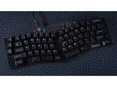</a></td>
<td align="center"><a href="https://github.com/hsgw/tartan">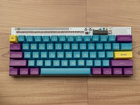</a></td>
<td align="center"><a href="https://github.com/yiancar/gingham_pcb">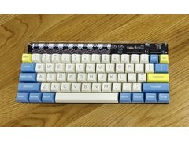</a></td>
<td align="center"><a href="https://github.com/yiancar/Seigaiha">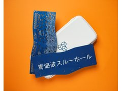</a></td>
<td align="center"><a href="https://github.com/yiancar/gingham_usbc_pcb">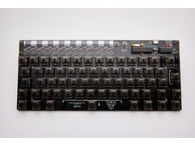</a></td>
</tr>
<tr>
<td align="center"><a href="https://github.com/kb-elmo/sesame">Sesame</a></td>
<td align="center"><a href="https://github.com/hsgw/tartan">Tartan</a></td>
<td align="center"><a href="https://github.com/yiancar/gingham_pcb">Gingham</a></td>
<td align="center"><a href="https://github.com/yiancar/Seigaiha">Seigaiha</a></td>
<td align="center"><a href="https://github.com/yiancar/gingham_usbc_pcb">Gingham USB-C</a></td>
</tr>
<tr>
<td align="center"><a href="https://github.com/piit79/donegal-c">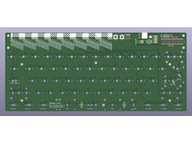</a></td>
<td align="center"><a href="https://github.com/itsnoteasy/gingerham">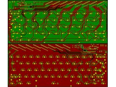</a></td>
<td align="center"><a href="https://github.com/slonket/segment-keyboard" style="display:inline-block;width:180px;height:135px;line-height:135px;text-align:center;background:#f6f8fa;border:1px dashed #ccc;color:#888;">no photo</a></td>
<td align="center"><a href="https://github.com/jamerhar/poppy">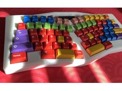</a></td>
<td align="center"><a href="https://github.com/luckybusted/luckyboard70" style="display:inline-block;width:180px;height:135px;line-height:135px;text-align:center;background:#f6f8fa;border:1px dashed #ccc;color:#888;">no photo</a></td>
</tr>
<tr>
<td align="center"><a href="https://github.com/piit79/donegal-c">Donegal-C</a></td>
<td align="center"><a href="https://github.com/itsnoteasy/gingerham">Gingerham</a></td>
<td align="center"><a href="https://github.com/slonket/segment-keyboard">SEGMENT</a></td>
<td align="center"><a href="https://github.com/jamerhar/poppy">Poppy</a></td>
<td align="center"><a href="https://github.com/luckybusted/luckyboard70">Luckyboard70</a></td>
</tr>
<tr>
<td align="center"><a href="https://github.com/FrancisUsher/plaid-lopro-keeb" style="display:inline-block;width:180px;height:135px;line-height:135px;text-align:center;background:#f6f8fa;border:1px dashed #ccc;color:#888;">no photo</a></td>
<td align="center"><a href="https://github.com/0xCB-dev/0xCB-Static">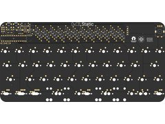</a></td>
<td align="center"><a href="https://github.com/b-karl/KBIC65">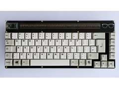</a></td>
<td align="center"></td>
<td align="center"><a href="https://github.com/null-ll/basketweave">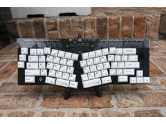</a></td>
</tr>
<tr>
<td align="center"><a href="https://github.com/FrancisUsher/plaid-lopro-keeb">Plaid LoPro</a></td>
<td align="center"><a href="https://github.com/0xCB-dev/0xCB-Static">0xCB Static</a></td>
<td align="center"><a href="https://github.com/b-karl/KBIC65">KBIC65</a></td>
<td align="center"><a href="https://github.com/coseyfannitutti/discipline">Discipline</a></td>
<td align="center"><a href="https://github.com/null-ll/basketweave">Basketweave</a></td>
</tr>
<tr>
<td align="center"><a href="https://github.com/null-ll/pinstripe">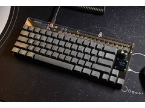</a></td>
<td align="center"><a href="https://github.com/mohoyt/lagom">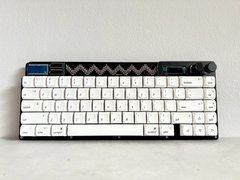</a></td>
<td align="center"><a href="https://github.com/subottimale/Claudia">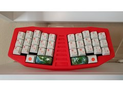</a></td>
<td align="center"><a href="https://github.com/sugengz/Kawung65">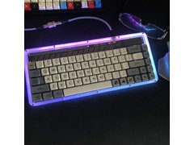</a></td>
<td align="center"><a href="https://github.com/ZeroZeroOne-dev/00Key">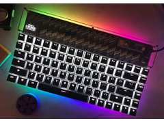</a></td>
</tr>
<tr>
<td align="center"><a href="https://github.com/null-ll/pinstripe">Pinstripe</a></td>
<td align="center"><a href="https://github.com/mohoyt/lagom">Lagom</a></td>
<td align="center"><a href="https://github.com/subottimale/Claudia">Claudia</a></td>
<td align="center"><a href="https://github.com/sugengz/Kawung65">Kawung65</a></td>
<td align="center"><a href="https://github.com/ZeroZeroOne-dev/00Key">00Key</a></td>
</tr>
</table>

## 75% / TKL / 1800 / full-size

<table>
<tr>
<td align="center"><a href="https://github.com/ramonimbao/Herringbone-Pro" style="display:inline-block;width:180px;height:135px;line-height:135px;text-align:center;background:#f6f8fa;border:1px dashed #ccc;color:#888;">no photo</a></td>
<td align="center"><a href="https://github.com/ramonimbao/Herringbone">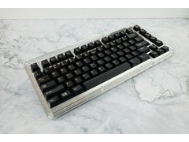</a></td>
<td align="center"><a href="https://github.com/0xCB-dev/0xCB-Jupiter" style="display:inline-block;width:180px;height:135px;line-height:135px;text-align:center;background:#f6f8fa;border:1px dashed #ccc;color:#888;">no photo</a></td>
<td align="center"><a href="https://github.com/ndeporceri/NMB-75" style="display:inline-block;width:180px;height:135px;line-height:135px;text-align:center;background:#f6f8fa;border:1px dashed #ccc;color:#888;">no photo</a></td>
<td align="center"><a href="https://github.com/LordRabel/Rabelius">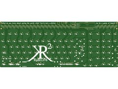</a></td>
</tr>
<tr>
<td align="center"><a href="https://github.com/ramonimbao/Herringbone-Pro">Herringbone Pro</a></td>
<td align="center"><a href="https://github.com/ramonimbao/Herringbone">Herringbone</a></td>
<td align="center"><a href="https://github.com/0xCB-dev/0xCB-Jupiter">0xCB Jupiter</a></td>
<td align="center"><a href="https://github.com/ndeporceri/NMB-75">NMB-75</a></td>
<td align="center"><a href="https://github.com/LordRabel/Rabelius">Rabelius</a></td>
</tr>
<tr>
<td align="center"><a href="https://github.com/Davines123/Swissterium" style="display:inline-block;width:180px;height:135px;line-height:135px;text-align:center;background:#f6f8fa;border:1px dashed #ccc;color:#888;">no photo</a></td>
<td align="center"><a href="https://github.com/JZolko/southpaw_discipline">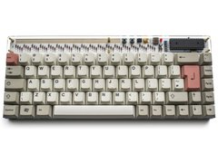</a></td>
<td align="center"><a href="https://github.com/D3lta-M3/D3lta_M3-Southpaw-65" style="display:inline-block;width:180px;height:135px;line-height:135px;text-align:center;background:#f6f8fa;border:1px dashed #ccc;color:#888;">no photo</a></td>
<td align="center"><a href="https://github.com/jbennet-t/TKLpcb" style="display:inline-block;width:180px;height:135px;line-height:135px;text-align:center;background:#f6f8fa;border:1px dashed #ccc;color:#888;">no photo</a></td>
<td align="center"><a href="https://github.com/mechlovin/PCB/tree/master/1800-Compact">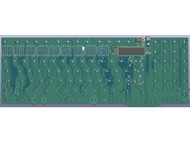</a></td>
</tr>
<tr>
<td align="center"><a href="https://github.com/Davines123/Swissterium">Swissterium</a></td>
<td align="center"><a href="https://github.com/JZolko/southpaw_discipline">Southpaw Discipline</a></td>
<td align="center"><a href="https://github.com/D3lta-M3/D3lta_M3-Southpaw-65">D3lta_M3 Southpaw 65</a></td>
<td align="center"><a href="https://github.com/jbennet-t/TKLpcb">TKLpcb</a></td>
<td align="center"><a href="https://github.com/mechlovin/PCB/tree/master/1800-Compact">TH1800</a></td>
</tr>
<tr>
<td align="center"><a href="https://github.com/coseyfannitutti/mysterium">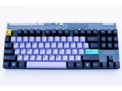</a></td>
<td align="center"><a href="https://github.com/lyso1/LCK75">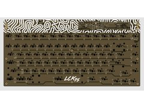</a></td>
<td align="center"><a href="https://github.com/lyso1/LCK75v3">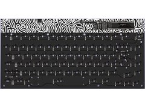</a></td>
<td align="center"><a href="https://github.com/yiancar/barleycorn_pcb">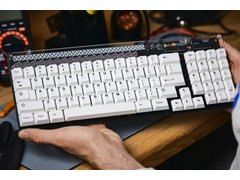</a></td>
<td align="center"><a href="https://github.com/mohoyt/sthlmkb-storre">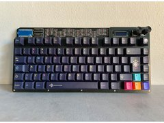</a></td>
</tr>
<tr>
<td align="center"><a href="https://github.com/coseyfannitutti/mysterium">Mysterium</a></td>
<td align="center"><a href="https://github.com/lyso1/LCK75">LCK75</a></td>
<td align="center"><a href="https://github.com/lyso1/LCK75v3">LCK75 v3</a></td>
<td align="center"><a href="https://github.com/yiancar/barleycorn_pcb">Barleycorn</a></td>
<td align="center"><a href="https://github.com/mohoyt/sthlmkb-storre">Större</a></td>
</tr>
</table>

## Ortho / ergo / split

<table>
<tr>
<td align="center"><a href="https://github.com/olkb/planck_thk" style="display:inline-block;width:180px;height:135px;line-height:135px;text-align:center;background:#f6f8fa;border:1px dashed #ccc;color:#888;">no photo</a></td>
<td align="center"><a href="https://github.com/zzsmoky/EygptBar-70">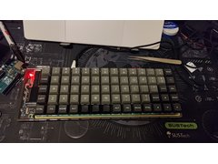</a></td>
<td align="center"><a href="https://github.com/dcpedit/redherring">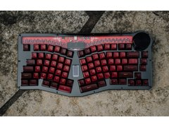</a></td>
<td align="center"><a href="https://github.com/Jrodna/OrthoCode">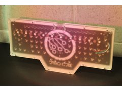</a></td>
<td align="center"><a href="https://github.com/stevennguyen/framework">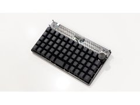</a></td>
</tr>
<tr>
<td align="center"><a href="https://github.com/olkb/planck_thk">Planck THK</a></td>
<td align="center"><a href="https://github.com/zzsmoky/EygptBar-70">EgyptBar-70</a></td>
<td align="center"><a href="https://github.com/dcpedit/redherring">Red Herring</a></td>
<td align="center"><a href="https://github.com/Jrodna/OrthoCode">OrthoCode</a></td>
<td align="center"><a href="https://github.com/stevennguyen/framework">Framework</a></td>
</tr>
<tr>
<td align="center"><a href="https://github.com/peej/crosshatch-keyboard">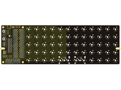</a></td>
<td align="center"><a href="https://github.com/RSchneyer/masochist">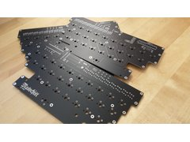</a></td>
<td align="center"><a href="https://github.com/peej/orthgyle-keyboard">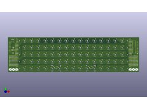</a></td>
<td align="center"><a href="https://github.com/hsgw/Madras">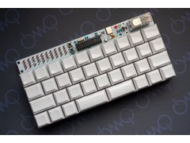</a></td>
<td align="center"><a href="https://github.com/mothdotmonster/OK96">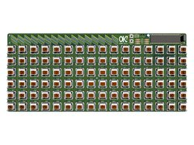</a></td>
</tr>
<tr>
<td align="center"><a href="https://github.com/peej/crosshatch-keyboard">Crosshatch</a></td>
<td align="center"><a href="https://github.com/RSchneyer/masochist">Masochist</a></td>
<td align="center"><a href="https://github.com/peej/orthgyle-keyboard">Orthgyle</a></td>
<td align="center"><a href="https://github.com/hsgw/Madras">Madras</a></td>
<td align="center"><a href="https://github.com/mothdotmonster/OK96">OK96</a></td>
</tr>
<tr>
<td align="center"><a href="https://github.com/covah901/CN62B---Ergo-Keyboard">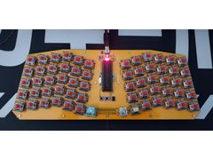</a></td>
<td align="center"><a href="https://github.com/ElKinoflop/Livewire">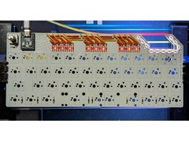</a></td>
<td align="center"><a href="https://github.com/hsgw/plaid">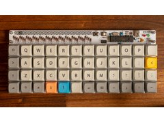</a></td>
<td align="center"><a href="https://github.com/dsanchezseco/punk75">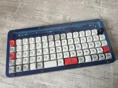</a></td>
<td align="center"><a href="https://github.com/peej/lumberjack-keyboard">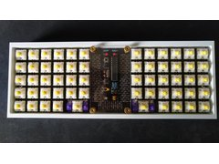</a></td>
</tr>
<tr>
<td align="center"><a href="https://github.com/covah901/CN62B---Ergo-Keyboard">CN62B</a></td>
<td align="center"><a href="https://github.com/ElKinoflop/Livewire">Livewire</a></td>
<td align="center"><a href="https://github.com/hsgw/plaid">Plaid</a></td>
<td align="center"><a href="https://github.com/dsanchezseco/punk75">punk75</a></td>
<td align="center"><a href="https://github.com/peej/lumberjack-keyboard">Lumberjack</a></td>
</tr>
<tr>
<td align="center"><a href="https://github.com/rtitmuss/torn">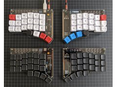</a></td>
<td align="center"><a href="https://github.com/thatfellarobin/axon">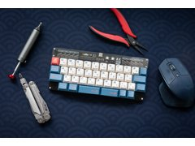</a></td>
<td align="center"><a href="https://github.com/Tsquash/lesovoz-files">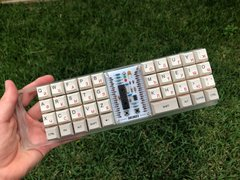</a></td>
<td align="center"><a href="https://github.com/RafaelCasamaximo/voidPointer">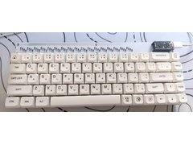</a></td>
<td align="center"><a href="https://github.com/cosimini/cambkb">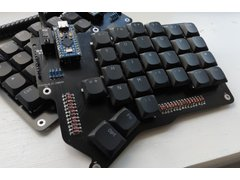</a></td>
</tr>
<tr>
<td align="center"><a href="https://github.com/rtitmuss/torn">Torn</a></td>
<td align="center"><a href="https://github.com/thatfellarobin/axon">Axon</a></td>
<td align="center"><a href="https://github.com/Tsquash/lesovoz-files">Lesovoz</a></td>
<td align="center"><a href="https://github.com/RafaelCasamaximo/voidPointer">voidPointer</a></td>
<td align="center"><a href="https://github.com/cosimini/cambkb">cambkb</a></td>
</tr>
<tr>
<td align="center"><a href="https://github.com/CityRunner/nullwing-keyboard">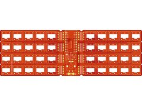</a></td>
<td></td>
<td></td>
<td></td>
<td></td>
</tr>
<tr>
<td align="center"><a href="https://github.com/CityRunner/nullwing-keyboard">Nullwing Keyboard</a></td>
<td></td>
<td></td>
<td></td>
<td></td>
</tr>
</table>

## 40% and smaller / macropads

<table>
<tr>
<td align="center"><a href="https://github.com/ramonimbao/Chevron">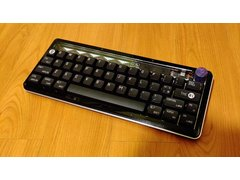</a></td>
<td align="center"><a href="https://github.com/ramonimbao/AELITH">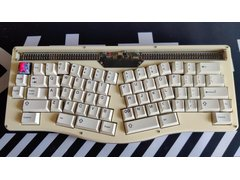</a></td>
<td align="center"><a href="https://github.com/hadi-syafiq/F12">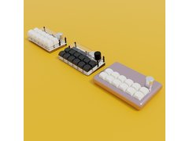</a></td>
<td align="center"><a href="https://github.com/ivndbt/neopad">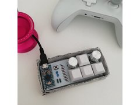</a></td>
<td align="center"><a href="https://github.com/ivndbt/late-9">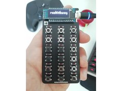</a></td>
</tr>
<tr>
<td align="center"><a href="https://github.com/ramonimbao/Chevron">Chevron</a></td>
<td align="center"><a href="https://github.com/ramonimbao/AELITH">AELITH</a></td>
<td align="center"><a href="https://github.com/hadi-syafiq/F12">F12</a></td>
<td align="center"><a href="https://github.com/ivndbt/neopad">Neopad</a></td>
<td align="center"><a href="https://github.com/ivndbt/late-9">LATE-9</a></td>
</tr>
<tr>
<td align="center"></td>
<td align="center"></td>
<td align="center"></td>
<td align="center"></td>
<td align="center"></td>
</tr>
<tr>
<td align="center"><a href="https://github.com/piit79/mysteripad">Mysteripad</a></td>
<td align="center"><a href="https://github.com/ghostseven/Draytronics-Scarlet-PCB-V1">Draytronics Scarlet</a></td>
<td align="center"><a href="https://github.com/ghostseven/Draytronics-Jade-PCB-V1">Draytronics Jade</a></td>
<td align="center"><a href="https://github.com/syauqi-alias/The-Kenit-Numpad">The Kenit</a></td>
<td align="center"><a href="https://github.com/syauqi-alias/Mechanical-Keyboard-Malay-Retro-Design">Malay Retro</a></td>
</tr>
<tr>
<td align="center"></td>
<td align="center"></td>
<td align="center"><a href="https://github.com/cmanon/numpad-keyboard" style="display:inline-block;width:180px;height:135px;line-height:135px;text-align:center;background:#f6f8fa;border:1px dashed #ccc;color:#888;">no photo</a></td>
<td align="center"></td>
<td align="center"></td>
</tr>
<tr>
<td align="center"><a href="https://github.com/htpkbs/pin-check">Pin-Check</a></td>
<td align="center"><a href="https://github.com/isandrocks/Causeway_THT">Causeway THT</a></td>
<td align="center"><a href="https://github.com/cmanon/numpad-keyboard">numpad-keyboard</a></td>
<td align="center"><a href="https://github.com/coseyfannitutti/discipad">Discipad</a></td>
<td align="center"><a href="https://github.com/coseyfannitutti/romeo">Romeo</a></td>
</tr>
<tr>
<td align="center"></td>
<td align="center"></td>
<td align="center"></td>
<td align="center"></td>
<td align="center"></td>
</tr>
<tr>
<td align="center"><a href="https://github.com/ericrlau/NumDiscipline">NumDiscipline</a></td>
<td align="center"><a href="https://github.com/Keycapsss/Plaid-Pad">Plaid-Pad</a></td>
<td align="center"><a href="https://github.com/mohoyt/litl">Litl</a></td>
<td align="center"><a href="https://github.com/peej/rosaline-keyboard">Rosaline</a></td>
<td align="center"><a href="https://github.com/godders/scientist">Scientist</a></td>
</tr>
</table>

## Confirmed TH but no dedicated GitHub hardware repo found

<table>
<tr>
<td align="center"></td>
<td align="center"></td>
<td align="center"></td>
<td align="center"></td>
<td align="center"></td>
</tr>
<tr>
<td align="center"><a href="https://github.com/qmk/qmk_firmware/tree/master/keyboards/argyle">Argyle 60</a></td>
<td align="center"><a href="https://github.com/qmk/qmk_firmware/tree/master/keyboards/mechwild/mercutio">Mercutio</a></td>
<td align="center"><a href="https://github.com/qmk/qmk_firmware/tree/master/keyboards/nopunin10did/jabberwocky">Jabberwocky</a></td>
<td align="center"><a href="https://github.com/qmk/qmk_firmware/tree/master/keyboards/keyhive/lattice60">Lattice60</a></td>
<td align="center"><a href="https://github.com/qmk/qmk_firmware/tree/master/keyboards/crimsonkeyboards/resume1800">Resume1800</a></td>
</tr>
<tr>
<td align="center"></td>
<td align="center"></td>
<td align="center"></td>
<td align="center"></td>
<td align="center"></td>
</tr>
<tr>
<td align="center"><a href="https://github.com/qmk/qmk_firmware/tree/master/keyboards/rot13labs/hackboard">HACKBOARD</a></td>
<td align="center"><a href="https://github.com/qmk/qmk_firmware/tree/master/keyboards/adpenrose/mine">Mine</a></td>
<td align="center"><a href="https://github.com/qmk/qmk_firmware/tree/master/keyboards/tkw/stoutgat/v1">Stoutgat v1</a></td>
<td align="center"><a href="https://github.com/qmk/qmk_firmware/tree/master/keyboards/rart/rartland">Rartland</a></td>
<td align="center"><a href="https://github.com/qmk/qmk_firmware/tree/master/keyboards/skergo">SKErgo</a></td>
</tr>
<tr>
<td align="center"></td>
<td align="center"></td>
<td align="center"></td>
<td align="center"><a href="https://github.com/qmk/qmk_firmware/tree/master/keyboards/ckeys/nakey" style="display:inline-block;width:180px;height:135px;line-height:135px;text-align:center;background:#f6f8fa;border:1px dashed #ccc;color:#888;">no photo</a></td>
<td align="center"></td>
</tr>
<tr>
<td align="center"><a href="https://github.com/qmk/qmk_firmware/tree/master/keyboards/kagizaraya/chidori">Chidori</a></td>
<td align="center"><a href="https://github.com/qmk/qmk_firmware/tree/master/keyboards/mechanickeys/miniashen40">Mini Ashen 40</a></td>
<td align="center"><a href="https://github.com/qmk/qmk_firmware/tree/master/keyboards/draytronics/daisy">Daisy</a></td>
<td align="center"><a href="https://github.com/qmk/qmk_firmware/tree/master/keyboards/ckeys/nakey">naKey</a></td>
<td align="center"><a href="https://github.com/nullbitsco/nibble">Nibble</a></td>
</tr>
<tr>
<td align="center"></td>
<td align="center"><a href="#" style="display:inline-block;width:180px;height:135px;line-height:135px;text-align:center;background:#f6f8fa;border:1px dashed #ccc;color:#888;">no photo</a></td>
<td align="center"><a href="#" style="display:inline-block;width:180px;height:135px;line-height:135px;text-align:center;background:#f6f8fa;border:1px dashed #ccc;color:#888;">no photo</a></td>
<td align="center"></td>
<td align="center"><a href="https://keebd.com/" style="display:inline-block;width:180px;height:135px;line-height:135px;text-align:center;background:#f6f8fa;border:1px dashed #ccc;color:#888;">no photo</a></td>
</tr>
<tr>
<td align="center"><a href="https://github.com/nullbitsco/tidbit">Tidbit</a></td>
<td align="center"><a href="#">FinnGus</a></td>
<td align="center"><a href="#">GameBuddy</a></td>
<td align="center"><a href="https://www.40percent.club/2020/08/the-aardvark.html">Aardvark</a></td>
<td align="center"><a href="https://keebd.com/">Treadstone48</a></td>
</tr>
<tr>
<td align="center"></td>
<td align="center"></td>
<td></td>
<td></td>
<td></td>
</tr>
<tr>
<td align="center"><a href="https://cannonkeys.com/collections/keyboard-kits">CannonKeys Practice60/65</a></td>
<td align="center"><a href="https://cannonkeys.com/collections/keyboard-kits">CannonKeys Stacked</a></td>
<td></td>
<td></td>
<td></td>
</tr>
</table>

## TH design but module controller ("TH-adjacent")

<table>
<tr>
<td align="center"></td>
<td align="center"></td>
<td align="center"></td>
<td align="center"></td>
<td align="center"></td>
</tr>
<tr>
<td align="center"><a href="https://github.com/uuupah/pain27">Pain27</a></td>
<td align="center"><a href="https://github.com/Envious-Data/Env-KB">Env-KB Delirium</a></td>
<td align="center"><a href="https://github.com/tjeffree/lumberelite">Lumberelite</a></td>
<td align="center"><a href="https://github.com/Ardakilic/woodpecker-keyboard">Woodpecker</a></td>
<td align="center"><a href="https://github.com/qmk/qmk_firmware/tree/master/keyboards/0_sixty">0-Sixty</a></td>
</tr>
<tr>
<td align="center"></td>
<td align="center"></td>
<td align="center"></td>
<td align="center"><a href="https://github.com/qmk/qmk_firmware/tree/master/keyboards/ortho5by12" style="display:inline-block;width:180px;height:135px;line-height:135px;text-align:center;background:#f6f8fa;border:1px dashed #ccc;color:#888;">no photo</a></td>
<td align="center"></td>
</tr>
<tr>
<td align="center"><a href="https://github.com/qmk/qmk_firmware/tree/master/keyboards/labyrinth75">Labyrinth75</a></td>
<td align="center"><a href="https://github.com/qmk/qmk_firmware/tree/master/keyboards/keyprez/rhino">Rhino</a></td>
<td align="center"><a href="https://github.com/qmk/qmk_firmware/tree/master/keyboards/hackpad">Hackpad</a></td>
<td align="center"><a href="https://github.com/qmk/qmk_firmware/tree/master/keyboards/ortho5by12">ortho5by12</a></td>
<td align="center"><a href="https://github.com/rarepotato8de/3x3macropad">3x3macropad</a></td>
</tr>
<tr>
<td align="center"></td>
<td align="center"></td>
<td align="center"><a href="https://github.com/piit79/kilt-keyboard" style="display:inline-block;width:180px;height:135px;line-height:135px;text-align:center;background:#f6f8fa;border:1px dashed #ccc;color:#888;">no photo</a></td>
<td align="center"></td>
<td align="center"></td>
</tr>
<tr>
<td align="center"><a href="https://github.com/MakerJake01/J73K_keyboard">J73K</a></td>
<td align="center"><a href="https://gitlab.com/m-lego/m65">M65 (m-lego)</a></td>
<td align="center"><a href="https://github.com/piit79/kilt-keyboard">Kilt</a></td>
<td align="center"><a href="https://github.com/peej/tripel-keyboard">Tripel</a></td>
<td align="center"><a href="https://github.com/cfbender/keyboards">Nightmare</a></td>
</tr>
<tr>
<td align="center"></td>
<td align="center"></td>
<td align="center"></td>
<td align="center"></td>
<td align="center"></td>
</tr>
<tr>
<td align="center"><a href="https://github.com/cfbender/keyboards">May Pad</a></td>
<td align="center"><a href="https://mechwild.com/product/orange-boy-ergo/">Orange Boy Ergo (OBE)</a></td>
<td align="center"><a href="https://github.com/CityRunner/nullwing-keyboard">Nullwing</a></td>
<td align="center"><a href="https://github.com/peej/for-science-keyboard">For Science</a></td>
<td align="center"><a href="https://github.com/peej/for-split-keyboard">Split Infinitive</a></td>
</tr>
<tr>
<td align="center"></td>
<td align="center"></td>
<td align="center"></td>
<td align="center"></td>
<td align="center"></td>
</tr>
<tr>
<td align="center"><a href="https://github.com/peej/for-idle-hands-keyboard">For Idle Hands</a></td>
<td align="center"><a href="https://github.com/peej/bicycle-keyboard">Bicycle</a></td>
<td align="center"><a href="https://github.com/piit79/lumberjack-pro-keyboard">Lumberjack Pro</a></td>
<td align="center"><a href="https://github.com/piit79/Southpaw75">Southpaw75</a></td>
<td align="center"><a href="https://github.com/ivndbt/obiwanstenobit">ObiWanStenobit</a></td>
</tr>
<tr>
<td align="center"></td>
<td align="center"></td>
<td></td>
<td></td>
<td></td>
</tr>
<tr>
<td align="center"><a href="https://github.com/nullbitsco/snap">SNAP</a></td>
<td align="center"><a href="https://github.com/mohoyt/cyoa_ortho">CYOA Ortho</a></td>
<td></td>
<td></td>
<td></td>
</tr>
</table>
